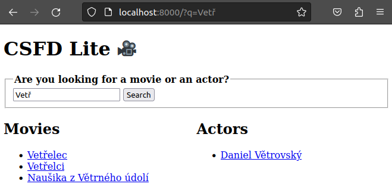
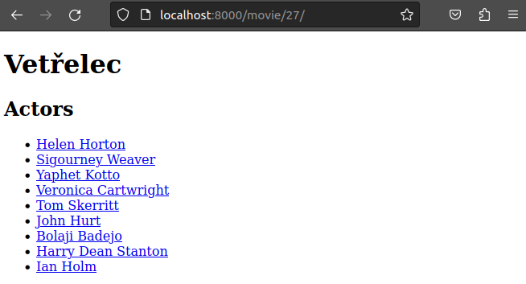

# Django CSFD Lite 🎥

The goal is build a web app which contains TOP 300 movies and related actors from
[csfd.cz](https://www.csfd.cz/zebricky/filmy/nejlepsi/). It should allow to search them
by input on the homepage. Search is case-insensitive and doesn't care accent.
Movie detail page contains links to related actors and vice versa.

## Screens

### Homepage

### Detail

## Web scraping

The Django command downloads movies and actors with standard request and beautifulsoup libraries.
The intent is to protect the database and don't call requests per movie or actor (solved by `bulk_create`).

On the other hand db queries are sent for every list of movies page because I don't want to hold
all temporary data in python memory. For 300 movies only on my machine it's really unnecessary,
but it could be problem for environment with limited memory and larger number of movies.
This part is questionable because it depends on the limits that we have. Another question is transaction usage.

The scraping is limited by `sleep` function because of protecting the target website.

## Disclaimer

Technically, the app downloads 299 movies only because the first page with a list of movies contains only 99 items.
Furthermore, the app is prepared for usage on local machines only (it means not for production).

## It would be nice

- Dockerize the app
- Add pre-commit hook and don't use `ruff --fix . && isort . && black .` 🙂

## How to use

1. Install all dependencies from `requirements.txt` (includes dev libraries)
2. Then run `python manage.py runserver`
3. Visit `http://localhost:8000`
4. For testing run `pytest`
